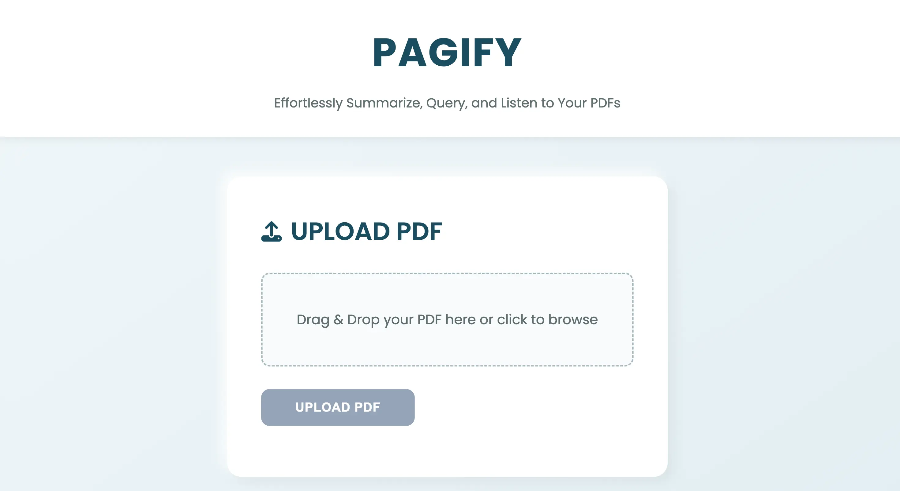

# Pagify - AI-Powered PDF Summarizer & Query Tool



**Pagify** is a web application that allows users to upload PDF documents, generate AI-powered summaries, ask questions about the content, and listen to responses in Indian English using text-to-speech (TTS). Built with the MERN stack (MongoDB, Express.js, React-free frontend, Node.js) and powered by OpenAI’s GPT-3.5-turbo, Pagify offers a seamless and accessible way to interact with PDFs.

Try it at [Pagify](https://pagify.aakarshtiwari.com).

## Features

- **PDF Upload**: Upload PDFs (up to 5MB, 10 pages) for processing.
- **AI Summarization**: Generate concise summaries of PDF content using OpenAI’s GPT-3.5-turbo.
- **Question Answering**: Ask questions about the PDF and get precise, AI-generated answers.
- **Text-to-Speech**: Listen to summaries and answers in Indian English (`en-IN`) using the Web Speech API.
- **Responsive Design**: Mobile-friendly UI with a clean, modern interface using Poppins font and a teal palette.
- **Accessibility**: ARIA labels and alt text for improved screen reader support.
- **SEO Optimized**: Meta tags, structured data (JSON-LD), and canonical URLs for better search engine visibility.

## Tech Stack

- **Frontend**: HTML, CSS, JavaScript (vanilla, no React), Font Awesome, Google Fonts
- **Backend**: Node.js, Express.js
- **Database**: MongoDB (via Mongoose)
- **AI**: OpenAI GPT-3.5-turbo for summarization and Q&A
- **TTS**: Web Speech API for Indian English voice output
- **File Handling**: Multer for PDF uploads, pdf-parse for text extraction
- **Deployment**:
  - Frontend: Vercel
  - Backend: Render
- **Other**: CORS, dotenv for environment variables

## Prerequisites

To run Pagify locally, ensure you have:

- Node.js (v16 or higher)
- MongoDB (local or Atlas)
- An OpenAI API key (sign up at [OpenAI](https://platform.openai.com))
- Git
- A modern browser (Chrome recommended for `en-IN` TTS support)

## Installation

1. **Clone the Repository**:
   ```bash
   git clone https://github.com/aakarshtiwari26/aipdfreader-three.git
   cd aipdfreader-three
   ```

2. **Backend Setup**:
   - Navigate to the backend directory:
     ```bash
     cd backend
     ```
   - Install dependencies:
     ```bash
     npm install
     ```
   - Create a `.env` file in the `backend` directory:
     ```
     PORT=10000
     MONGODB_URI=your_mongodb_connection_string
     OPENAI_API_KEY=your_openai_api_key
     ```
     - Replace `your_mongodb_connection_string` with your MongoDB URI (e.g., `mongodb://localhost:27017/pagify` or MongoDB Atlas URI).
     - Replace `your_openai_api_key` with your OpenAI API key.
   - Start the backend server:
     ```bash
     npm run dev
     ```

3. **Frontend Setup**:
   - Navigate to the frontend directory (if separate; otherwise, root contains `index.html`):
     ```bash
     cd frontend
     ```
   - No build step is needed (vanilla HTML/CSS/JS).
   - Serve the frontend using a static server (e.g., `live-server`):
     ```bash
     npm install -g live-server
     live-server
     ```
   - Alternatively, deploy to Vercel (see Deployment section).

4. **Verify**:
   - Backend: `http://localhost:10000/health` should return `{ "status": "healthy" }`.
   - Frontend: Open `http://localhost:8080` (or port shown by `live-server`) to access Pagify.

## Usage

1. **Upload a PDF**:
   - Drag and drop a PDF file (<5MB, ≤10 pages) or click to browse.
   - Pagify processes the PDF and displays a summary.

2. **View Summary**:
   - The AI-generated summary appears in the "Summary" section.
   - Click the speaker icon to hear the summary in Indian English.

3. **Ask Questions**:
   - Enter a question about the PDF content in the "Ask a Question" section.
   - Submit to get an AI-generated answer.
   - Click the speaker icon to hear the answer.

4. **Text-to-Speech**:
   - Toggle the speaker button to play or pause the audio.
   - Best experienced in Chrome for Indian English (`en-IN`) voice support.

## Deployment

- **Frontend (Vercel)**:
  1. Push the frontend code to a GitHub repository.
  2. Connect the repo to Vercel via the Vercel dashboard.
  3. Configure `vercel.json` to proxy `/api/*` requests to your backend:
     ```json
     {
       "rewrites": [
         {
           "source": "/api/:path*",
           "destination": "your-backend-url/api/:path*"
         }
       ]
     }
     ```
     Replace `your-backend-url` with your backend’s public URL (e.g., hosted on Render).
  4. Deploy to get a URL like `https://your-app.vercel.app`.

- **Backend (Render)**:
  1. Push the backend code to a GitHub repository.
  2. Create a new Web Service on Render, linking to the repo.
  3. Set environment variables in Render’s dashboard:
     - `PORT`: 10000
     - `MONGODB_URI`: Your MongoDB connection string
     - `OPENAI_API_KEY`: Your OpenAI API key
  4. Deploy to get a public URL (e.g., `https://your-backend.onrender.com`).

- **SEO**:
  - Submit `https://reader.aakarshtiwari.com/sitemap.xml` to Google Search Console.
  - Ensure `robots.txt` allows crawling:
    ```
    User-agent: *
    Allow: /
    Sitemap: https://reader.aakarshtiwari.com/sitemap.xml
    ```

## Contributing

Contributions are welcome! To contribute:

1. Fork the repository.
2. Create a feature branch (`git checkout -b feature/your-feature`).
3. Commit changes (`git commit -m "Add your feature"`).
4. Push to the branch (`git push origin feature/your-feature`).
5. Open a Pull Request with a clear description.

Please follow the [Code of Conduct](CODE_OF_CONDUCT.md) and ensure code adheres to ESLint rules (for backend) and Prettier formatting.

## License

[MIT License](LICENSE) © 2025 Aakarsh Tiwari

## Contact

- **Author**: Aakarsh Tiwari
- **LinkedIn**: [linkedin.com/in/aakarshtiwari](https://www.linkedin.com/in/aakarshtiwari/)
- **GitHub**: [github.com/aakarshtiwari26](https://github.com/aakarshtiwari26)
- **Twitter**: [@aakarshtiwari08](https://twitter.com/aakarshtiwari08)

For issues or feature requests, open a ticket on the [GitHub repository](https://github.com/aakarshtiwari26/aipdfreader-three).